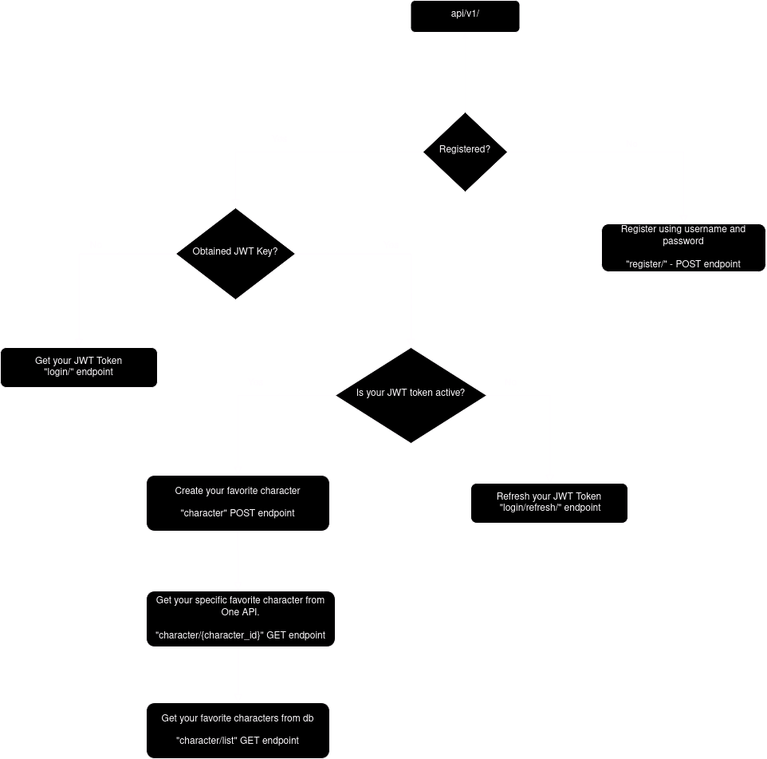

# Lord of the Rings Character API

## Key Points
- Utilized Django / Django Rest Framework to build RESTful API.
- Used Django's Class-Based views for a more organized code structure.
- User Registration with username/password.
- User Authentication with JWT Token Authentication for more secure user interaction.
- Initialized `.env` file for security purposes of your environment variables.
- Created `utils/` folder for extensibility of utility-like functions.
- Dockerized application to be more scalable and stable.
- Implemented 4 Endpoints:
    - RegisterUser
    - GetCharacter
    - AddFavoriteCharacter
    - ListFavoriteCharacters
- Wrote 6 unit test cases for the endpoints.
- Utilized PostgreSQL as the database for more efficient data storage.
- Created URLs based on RESTful URL conventions.
- Swagger Documentation(configured with drf-spectacular).
- Postman Collection(you can find it in the `external/` folder).
- API Flowchart(made with draw.io).

## Notes
Please keep in mind that this application is not production-ready. This project uses `entrypoint.sh` bash script to run application on Docker. We should use web server like `gunicorn` or `uvicorn` to serve our application to users. Also, to handle high traffic, we should use message brokers like RabbitMQ/Redis with Celery(asynchronous task queue) and monitoring software like Prometheus/Grafana to track application performance and identify areas for improvement.

## Project Structure

`character/`: Django app that contains all the models, views, and serializers.

`lotr_rest_api/`: Django project that contains configuration files, such as: settings, swagger urls, and etc.

`external/`: Contains external files, such as: flowchart, markdown files, postman collection, and etc.

`character/utils/`: Contains utility functions, such as: `get_character_by_id` to not repeat the code on multiple places.

`.env.example`: Contains environment variables, which should be copied to `.env` file.

## Endpoints

### Authentication Endpoints
- RegisterUser - POST - `/api/v1/register/`
- TokenObtainPair - POST - `/api/v1/login/`
- TokenRefresh - POST - `/api/v1/login/refresh/`

### Character Endpoints
- GetCharacter - This endpoint used for getting a character details by id from One API - GET - `/api/v1/character/{id}/`
- ListCharacters - This endpoint is for listing authenticated user's favorite characters - GET - `/api/v1/list/`
- AddFavoriteCharacter - This endpoint is for adding a character to authenticated user's favorite characters - POST - `/api/v1/character/`

## How to run the project?

There are two ways to run the project:
- Using Docker
- Using Python

### Using Docker

1. Clone the repository
2. Copy `.env.example` to `.env` and fill the variables
3. Run `docker compose up --build`
4. Access the API at `http://0.0.0.0:8000/api/v1/`
5. Access the Swagger documentation at `http://0.0.0.0:8000/swagger/`
6. Access the Redoc documentation at `http://0.0.0:8000/redoc/`

### Using Python
1. Clone the repository
2. Create a virtual environment
3. Install the dependencies using `pip install -r requirements.txt`
4. Copy `.env.example` to `.env` and fill the variables
5. Apply the migrations using `python manage.py makemigrations` and `python manage.py migrate`
6. Run the server using `python manage.py runserver`
7. Access the API at `http://127.0.0.1:8000/api/v1/`